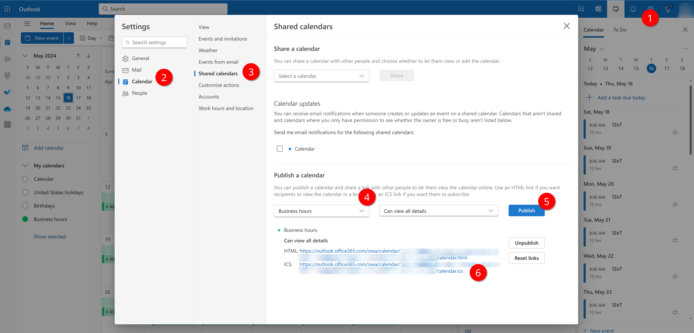
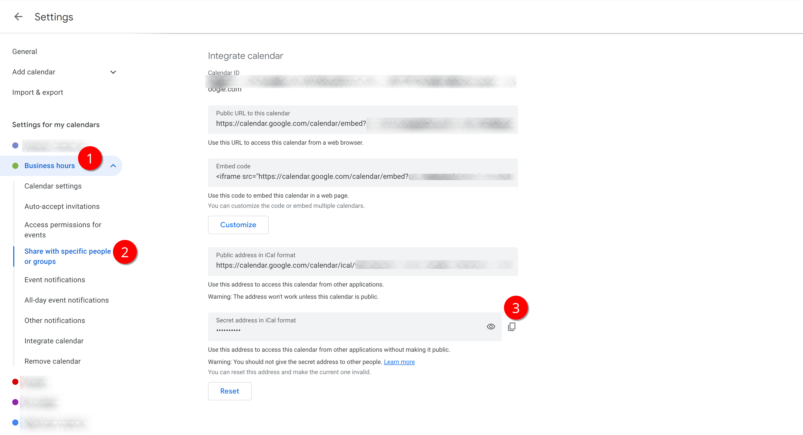

# Business Hours EF2 Extension

This extension is primarilly used for defining business hours for SLOs and other use cases. See the Dynatrace community [PRO TIP - Business hours in Dynatrace for SLOs or metric events](https://community.dynatrace.com/t5/Dynatrace-tips/PRO-TIP-Business-hours-in-Dynatrace-for-SLOs-or-metric-events/m-p/240367#M1202). Dynatrace extension generating artifical metric for calculating SLO considering business hours. This extension creates a metric key ```business_hours``` with the ```level``` dimension. Extension configuraiton allows you to define two sources of business hours definition:
- **Cron based** 
- **Calendar based**

## Cron based configuration

Create business hours level based on [cron](https://en.wikipedia.org/wiki/Cron) definition. It does not allow any exceptions.

- **Level name** - specifies level name (level metric dimension), e.g. _24x7_
- **Cron scheduler** - specify [cron-based](https://en.wikipedia.org/wiki/Cron) format when the metric for specified level
- **Weight** - metric value for the level when timestamp matches the cron definition
- **Weight outside hours** - __optional__ metric value for the metric outside of the cron definition, metric will not have any value if unset

## Calendar based configuration

Create busines hours level (or levels) based on remote calendar in ical format. 

This option allows you to flexible define your business hours level in a calendar configured in your preferred calendar system (Google calendar, Office 365, etc.) if calendar is accesible remotely from the ActiveGate where the extension is deployed.

- **Level name** - specifies level name (level metric dimension)  e.g. _24x7_ , unless **Use event summary** option is selected
- **Calendar URL** - URL of the remote calendar in [icalendar](https://en.wikipedia.org/wiki/ICalendar) format
- **Refresh interval** - Time in minutes between calendar refresh
- **Use event summary (title) as level** - If enabled, event summary of events are used as level names ignoring the **Level name**. When disabled configured level name is used if there is any calendar match in the remote calendar
- **Weight** - metric value for the level when timestamp matches the cron definition
- **Weight outside hours** - __optional__ metric value for the metric outside of the cron definition, metric will not have any value if unset


For calendar sharing see:

- [Microsoft 365](https://support.microsoft.com/en-us/office/calendar-sharing-in-microsoft-365-b576ecc3-0945-4d75-85f1-5efafb8a37b4)
In settings, choose Calendar (1), Shared calendars (2) scroll down to Publish calendar (3) choose your desired calednar (4), select all details and choose publish (5). Use the ICS URL (6) in the calendar based definition: 
- [Google calendar](https://support.google.com/calendar/answer/37082) 
In settings, choose desired calendar (1) and share with specific people or groups (2) and from the detail choose secret calendar address in ical format (3). Use this URL in the calendar based definition: 


## Extension Deployment

Extension requires Dynatrace version 1.286 or later.

If using prebuilt extension, first deploy certificates:

1. **Import the extensions certificate** - First, you have to import the ca.pem certificate to your Dynatrace see [https://docs.dynatrace.com/docs/shortlink/sign-extension#add-cert](https://docs.dynatrace.com/docs/shortlink/sign-extension#add-cert)
2. **Deploy the extensions certificate** - on your ActiveGates where the extension will be running - see [https://docs.dynatrace.com/docs/shortlink/sign-extension#remote-extensions](https://docs.dynatrace.com/docs/shortlink/sign-extension#remote-extensions)
3. **Import the extension zip** file directly in your environment see [https://docs.dynatrace.com/docs/shortlink/extension-lifecycle#upload-custom-extension](https://docs.dynatrace.com/docs/shortlink/extension-lifecycle#upload-custom-extension)
4. **Configure the extension** by adding a configuration with desired cron or calendar based configuration. You typically use just a single configuration.

